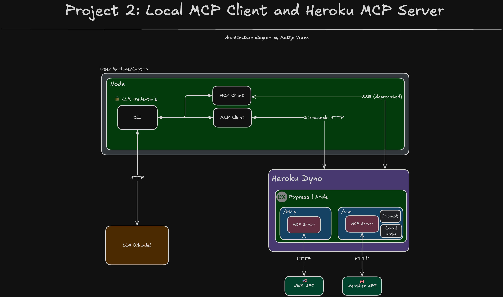

<p align="center">
<p align="center">
<a  href="https://modelcontextprotocol.io/introduction"></a>
<a  href="https://www.heroku.com/"></a>
<p/>
<p/>

# Exploring Model Context Protocol (MCP) with Heroku

The [Model Context Protocol (MCP)](https://modelcontextprotocol.io/introduction) seems to be everywhere these days. This projects showcases some of the inner workings of the MCP and architectural patterns when integrating with various Agents.

# Table of Contents

- [Exploring Model Context Protocol (MCP) with Heroku](#exploring-model-context-protocol-mcp-with-heroku)
- [Table of Contents](#table-of-contents)
  - [What does it do?](#what-does-it-do)
  - [Model Context Protocol Overview](#model-context-protocol-overview)
    - [What Problem Does MCP Solve?](#what-problem-does-mcp-solve)
    - [General MCP Architecture](#general-mcp-architecture)
  - [Project 1: Local MCP Client and Server](#project-1-local-mcp-client-and-server)
    - [Technologies used](#technologies-used)
    - [Configuration](#configuration)
      - [Requirements](#requirements)
      - [Setup](#setup)
          - [Local environment configuration](#local-environment-configuration)
        - [Development](#development)
  - [Project 2: Local MCP Client and Heroku MCP Server](#project-2-local-mcp-client-and-heroku-mcp-server)
    - [Technologies used](#technologies-used-1)
  - [Project 3: Agentforce and Heroku MCP Server integration (pre-native Agentforce MCP client)](#project-3-agentforce-and-heroku-mcp-server-integration-pre-native-agentforce-mcp-client)
  - [Project 4: Agentforce and Heroku MCP Servicer (native Agentforce MCP client)](#project-4-agentforce-and-heroku-mcp-servicer-native-agentforce-mcp-client)
- [License](#license)
- [Disclaimer](#disclaimer)

---

## What does it do?

The [Model Context Protocol (MCP)](https://modelcontextprotocol.io/introduction) seems to be everywhere these days. This repository has several projects that showcases some of the inner workings of the MCP and architectural patterns when integrating with various Agents.

## Model Context Protocol Overview

The Model Context Protocol (MCP) is an [open standard](https://github.com/modelcontextprotocol) designed to define how applications communicate and provide context to LLMs. MCP provides a structured way to exchange context, instructions, and results, enabling interoperability across different platforms and model providers.

### What Problem Does MCP Solve?

MCP transforms how you can build AI Agents in a standardized way across various systems. Each AI service has its own way of:

- Sharing context and data
- Invoking tools and functions
- Passing messages back and forth

The role of MCP is to standardize how this is done so that the development work for one AI service can be easily reused by a different AI service. Otherwise, the same functionality would have to be custom coded for each AI service separately.

### General MCP Architecture


The diagram illustrates a general MCP architecture of how various applications on a user's machine interact with different AI backends through the Model Context Protocol.

On the **User Machine/Laptop**, different applications have a built-in **MCP Client**. That includes the following:

- **Claude Desktop**
- **CLI (Command-Line Interface)**
- **Cursor**

Each one of these applications has its own MCP client, but for the sake of the diagram, it is a single MCP client box. The MCP Clients can communicate with various **MCP Servers**, each with a different hosting environment and purpose. The diagram showcases three examples, demonstrating the protocol's flexibility:

1.  **MCP Server A (local)**: A server running on the user's machine that can access **Local data**. It communicates with the MCP Client using the `stdio` transport. This server is accessing 3rd party service data, local data, and prompt information.
2.  **MCP Server B (AWS)**: A cloud-hosted server on AWS that connects to a **3rd party service B** via API calls. It uses `Server-Sent Events (SSE)` for communication, which is noted as a [deprecated method](https://modelcontextprotocol.io/docs/concepts/transports#server-sent-events-sse-deprecated).
3.  **MCP Server C (Heroku)**: Another cloud-hosted server on Heroku, which integrates with a **3rd party service A** and uses `Streamable HTTP` to communicate with the client.

This architecture allows any of the client applications (Cursor, CLI, Claude Desktop, etc.) to connect to any of the backend servers (local, AWS, or Heroku) through the MCP Client, without needing
to know the specific details of each server's implementation.

## Project 1: Local MCP Client and Server


This project showcases how to run an MCP Client and Server on your local machine, built with **Node.js**, **TypeScript**, and the **Anthropic SDK**. The architecture involves a single MCP client that communicates with a single MCP server over `stdio`:

The architecture diagram shows the following:

1.  **CLI Invocation**: The process starts when a user invokes a command through the **Command-Line Interface (CLI)**.
2.  **MCP Client (TypeScript)**: The CLI interacts with an **MCP Client** (implemented in TypeScript) to gather context from various resources.
3.  **MCP Server Capabilities**: The MCP Server is configured with the following capabilities:
    - **Local file**: Gathers local data ([data.json](./project_1/server/src/data/data.json))
    - **Invokes weather API tools**: Lists two weather API [tools](./project_1/server/src/index.ts#55)
    - **Prompt**: Sets a system [prompt](./project_1/server/src/index.ts#216)
4.  **Context Provisioning**: The MCP Client takes the payload from the MCP servers and passes it to the LLM as context.
5.  **LLM Processing**: The LLM (invoked via the [Anthropic SDK](./project_1/client/src/utils/MCPClient.ts#222)) processes the user's request using the context provided by the MCP Client and decides which resource to invoke.
6.  **CLI Output**: The LLM's response is returned to the CLI, which then displays the final output to the user.

This setup demonstrates a basic MCP interaction, showcasing how a single MCP Client can connect to a single MCP Server to enhance an LLM context.

### Technologies used

**Client**

- [Node.js](https://nodejs.org/en)
- [TypeScript](https://www.typescriptlang.org/)
- [Express](https://expressjs.com/)
- [Anthropic TypeScript API Library](https://github.com/anthropics/anthropic-sdk-typescript)
- [Model Context Protocol](https://github.com/modelcontextprotocol/typescript-sdk)

**Server**

- [Node.js](https://nodejs.org/en)
- [TypeScript](https://www.typescriptlang.org/)
- [Express](https://expressjs.com/)
- [Model Context Protocol](https://github.com/modelcontextprotocol/typescript-sdk)

### Configuration

#### Requirements

To run this application locally, you will need the following:

- An Anthropic [account](https://www.anthropic.com/) with a paid subscription to get an API key
- Node.js version 20 or later installed (type `node -v` in your terminal to check). Follow [instructions](https://nodejs.org/en/download) if you don't have node installed
- npm version 10.0.0 or later installed (type `npm -v` in your terminal to check). Node.js includes `npm`
- git installed. Follow the instructions to [install git](https://git-scm.com/downloads)

#### Setup

###### Local environment configuration

The first step is to clone the repository and install the project dependencies for both server and client folders via a terminal interface by running the `npm install` in the proper folder:

Client:

```
cd heroku-mcp/project_1/client
npm install
```

Server:

```
cd heroku-mcp/project_1/server
npm install
```

The second step is to create a `.env` file in the client folder. Find the `.env.example` file, copy it and rename it to `.env`.

Client:

```
cd heroku-mcp/project_1/client
cp .env.example .env
```

Edit the newly created `.env` file and update the variable with your Anthropic account API key information:

```
ANTHROPIC_API_KEY=
ANTHROPIC_CLAUDE_MODEL=claude-3-5-sonnet-20241022
```

> The ANTHROPIC_CLAUDE_MODEL=claude-3-5-sonnet-20241022 value is already set, to the Claude 3.5 model, but you are welcome to change it.

Once all of this is done, you are ready to run the application locally!

##### Development

To run the application locally, use the command line, navigate to the `client` folder, ensure the dependencies are installed properly, and run the following:

```
cd heroku-mcp/project_1/client
npm run dev
```

This will automatically run the Node script and you will be able to write prompts directly in your Command Line Interface.

When you make changes to your code, the server will automatically restart to fetch new changes.

## Project 2: Local MCP Client and Heroku MCP Server



This project showcases how to run a local MCP Client with an MCP Server that is hosted on Heroku, built with Node.js, TypeScript, and the Anthropic SDK. The architecture involves a two MCP clients that communicate with with their respective MCP servers over `streamable HTTP` and `SSE (server sent events)`:

TODO: Update the description

The architecture diagram shows the following:

1.  **CLI Invocation**: The process starts when a user invokes a command through the **Command-Line Interface (CLI)**.
2.  **MCP Client (TypeScript)**: The CLI interacts with an **MCP Client** (implemented in TypeScript) to gather context from various resources.
3.  **MCP Server Capabilities**: The MCP Server is configured with the following capabilities:
    - **Local file**: Gathers local data ([data.json](./project_1/server/src/data/data.json))
    - **Invokes weather API tools**: Lists two weather API [tools](./project_1/server/src/index.ts#55)
    - **Prompt**: Sets a system [prompt](./project_1/server/src/index.ts#216)
4.  **Context Provisioning**: The MCP Client takes the payload from the MCP servers and passes it to the LLM as context.
5.  **LLM Processing**: The LLM (invoked via the [Anthropic SDK](./project_1/client/src/utils/MCPClient.ts#222)) processes the user's request using the context provided by the MCP Client and decides which resource to invoke.
6.  **CLI Output**: The LLM's response is returned to the CLI, which then displays the final output to the user.

This setup demonstrates a basic MCP interaction, showcasing how a single MCP Client can connect to a single MCP Server to enhance an LLM context.

### Technologies used

**Client**

- [Node.js](https://nodejs.org/en)
- [TypeScript](https://www.typescriptlang.org/)
- [Express](https://expressjs.com/)
- [Anthropic TypeScript API Library](https://github.com/anthropics/anthropic-sdk-typescript)
- [Model Context Protocol](https://github.com/modelcontextprotocol/typescript-sdk)

**Server**

- [Node.js](https://nodejs.org/en)
- [TypeScript](https://www.typescriptlang.org/)
- [Express](https://expressjs.com/)
- [Model Context Protocol](https://github.com/modelcontextprotocol/typescript-sdk)
- [Heroku](https://www.heroku.com/)

## Project 3: Agentforce and Heroku MCP Server integration (pre-native Agentforce MCP client)

## Project 4: Agentforce and Heroku MCP Servicer (native Agentforce MCP client)

🚧 **Work in progress** 🚧

At the time of creating this repository, the native Agentforce MCP client was not globally available.

# License

[MIT](http://www.opensource.org/licenses/mit-license.html)

# Disclaimer

This software is to be considered "sample code", a Type B Deliverable, and is delivered "as-is" to the user. Salesforce bears no responsibility to support the use or implementation of this software.
